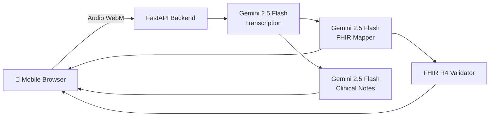

# 🩺 AI Ambient Scribe — Mobile-First FHIR Clinical Notes

> **PS-1**: Mobile-First Ambient AI Scribe with Real-Time FHIR Conversion

A mobile-first AI-powered clinical documentation tool that converts doctor-patient conversations into structured, **FHIR R4-compliant clinical data** in real-time. Supports **Hindi, English, and Hinglish** — designed for Indian healthcare settings.

---

## ✨ Features

| Feature | Description |
|---------|-------------|
| 🎤 **Real-time Audio Capture** | Record doctor-patient consultations with live waveform & timer |
| 🌐 **Multilingual Support** | Hindi, English, and Hinglish (code-mixed) transcription |
| 📋 **Structured Clinical Notes** | Auto-extracted: Chief Complaint, HPI, Vitals, Diagnoses, Medications, Follow-up |
| 🏥 **FHIR R4 Bundle** | Patient, Encounter, Observation, Condition, MedicationRequest resources |
| ✅ **FHIR Validation** | Real-time validation against R4 schema with coding system checks |
| ⚡ **Speed Metrics** | Pipeline timing for transcription + FHIR processing |
| 🔒 **Standard Coding** | SNOMED-CT, ICD-10, LOINC, RxNorm coding systems |

---

## 🏗️ Architecture



---

## 🛠️ Tech Stack

| Layer | Technology |
|-------|-----------|
| **Frontend** | React 19 + TypeScript + Vite + Tailwind CSS |
| **Backend** | Python FastAPI + Uvicorn |
| **AI Engine** | Google Gemini 2.5 Flash (Transcription & NLP) |
| **Data Standard** | HL7 FHIR R4 |
| **Design** | Glassmorphism dark theme, mobile-first responsive |

---

## 🚀 Quick Start

### Prerequisites
- **Node.js** 18+
- **Python** 3.10+
- **Gemini API Key** — [Get one here](https://aistudio.google.com/apikey)

### 1. Backend Setup

```bash
cd hackmatrix/backend

# Create virtual environment
python3 -m venv venv
source venv/bin/activate  # On Windows: venv\Scripts\activate

# Install dependencies
pip install -r requirements.txt

# Configure environment
echo "GEMINI_API_KEY=your_api_key_here" > .env

# Start server
uvicorn main:app --reload --port 8000
```

### 2. Frontend Setup

```bash
cd hackmatrix/frontend

# Install dependencies
npm install

# Start dev server
npm run dev
```

### 3. Open the app
Navigate to **http://localhost:5173** on your mobile browser or desktop.

---

## 📡 API Endpoints

| Method | Endpoint | Description |
|--------|----------|-------------|
| `GET` | `/` | Health check |
| `POST` | `/api/transcribe/?language=hi-en` | Audio → Text transcription |
| `POST` | `/api/fhir/` | Transcript → FHIR Bundle + Structured Notes |
| `POST` | `/api/fhir/validate` | Validate a FHIR R4 Bundle |

---

## 📁 Project Structure

```
hackmatrix/
├── backend/
│   ├── main.py                 # FastAPI app with CORS & logging
│   ├── requirements.txt        # Python dependencies
│   ├── .env                    # GEMINI_API_KEY
│   └── services/
│       ├── transcription.py    # Audio → text (Gemini + multilingual)
│       ├── fhir_mapper.py      # Text → FHIR R4 + structured notes
│       └── fhir_validator.py   # FHIR R4 validation engine
├── frontend/
│   ├── index.html              # PWA-ready HTML
│   ├── src/
│   │   ├── App.tsx             # Main app component
│   │   ├── App.css             # Custom animations & glass-morphism
│   │   ├── index.css           # Tailwind + base styles
│   │   └── main.tsx            # React entry point
│   ├── package.json
│   ├── vite.config.ts
│   └── tailwind.config.js
└── README.md
```

---

## 🎯 PS-1 Objectives Mapping

| Objective | Implementation |
|-----------|---------------|
| Capture conversations in real-time (Hindi + English mix) | ✅ MediaRecorder API → Gemini transcription with Hinglish prompt |
| Convert speech into structured clinical notes | ✅ Structured Notes extraction (CC, HPI, Vitals, Dx, Rx, Follow-up) |
| Map entities to FHIR resources | ✅ Patient, Encounter, Observation, Condition, MedicationRequest with SNOMED/ICD-10/LOINC |
| Demonstrate documentation speed improvement | ✅ Real-time speed metrics panel showing transcription + FHIR processing times |

---

## 👥 Target Stakeholders

- **General Physicians** in SME hospitals
- **Junior Doctors** / Duty Medical Officers
- **Nurses** documenting notes
- **Clinic Owners** in Tier 2/3 cities

---

*Built with ❤️ for Indian Healthcare*
