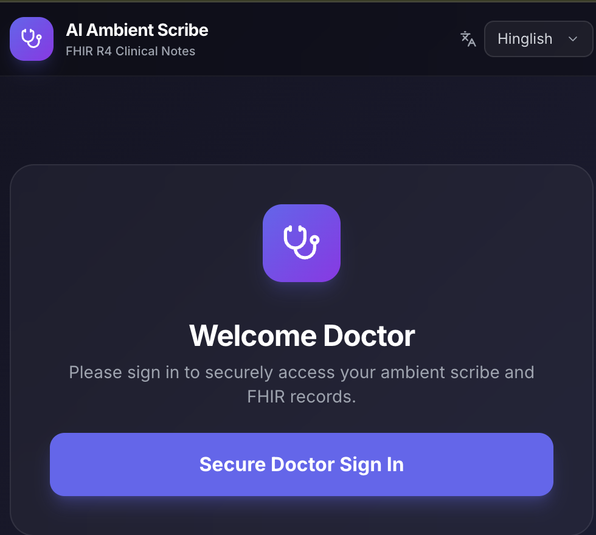
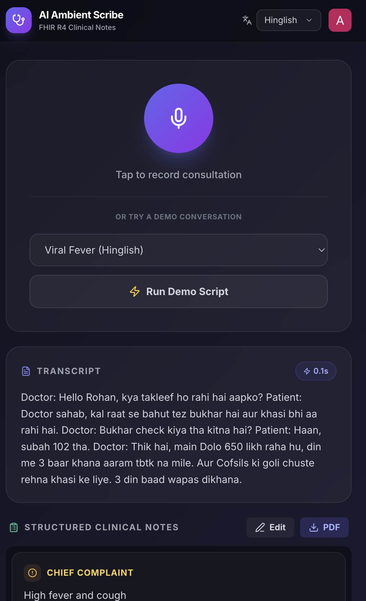
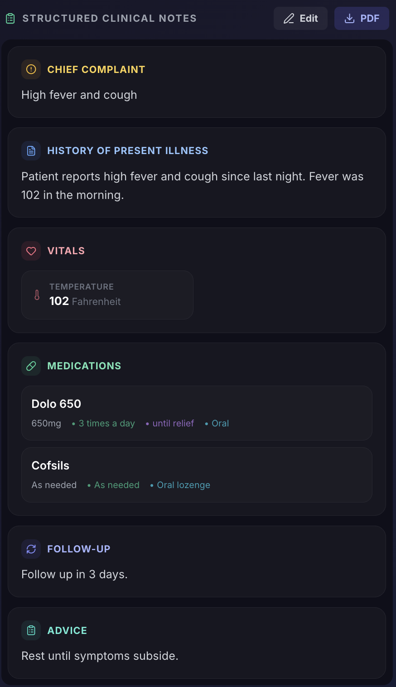
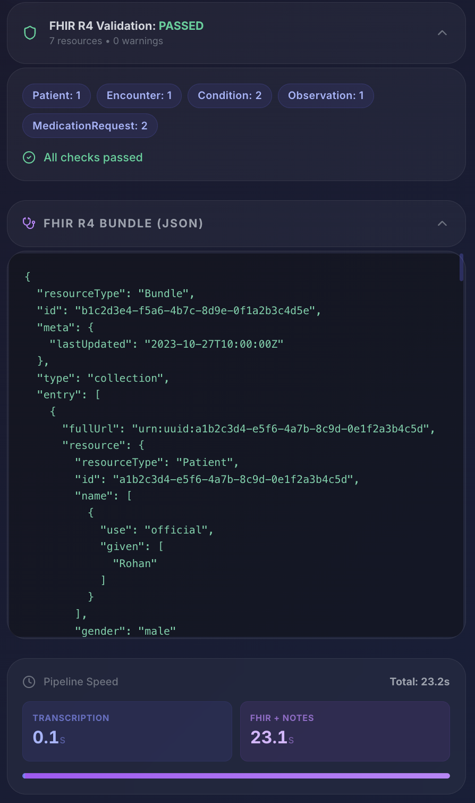
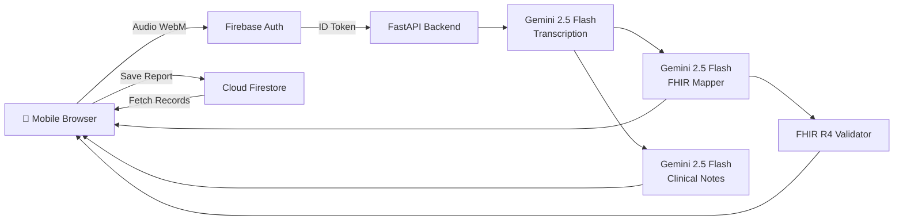

# AI Ambient Scribe — Mobile-First FHIR Clinical Notes

> **PS-1**: Mobile-First Ambient AI Scribe with Real-Time FHIR Conversion  
> **Team Eclipse** — Parth Singla (2401CS18) · Aditya Raj (2401MC56) · Aryan (2401CS48) · Manish Kumar (2401EE08)

A **production-deployed**, mobile-first AI-powered clinical documentation tool that converts doctor-patient conversations into structured, **FHIR R4-compliant clinical data** in real-time. Supports **Hindi, English, and Hinglish** — designed for Indian healthcare settings.

🌐 **Live App**: Frontend on [Vercel](https://vercel.com) · Backend on [Render](https://render.com)

---

## Screenshots

<p align="center">
  
  &nbsp;&nbsp;
  
  &nbsp;&nbsp;
  
  &nbsp;&nbsp;
  
</p>

---

## Proposed Approach & Solution

Indian healthcare faces a critical documentation bottleneck — doctors in Tier 2/3 cities spend nearly 30–40% of their consultation time manually writing notes, often in a mix of Hindi and English (Hinglish). This unstructured, paper-based workflow makes it nearly impossible to generate interoperable health records that comply with modern standards like HL7 FHIR R4. Existing voice-to-text solutions predominantly support English and lack clinical context understanding, making them ineffective for the Indian healthcare landscape.

Our solution, **AI Ambient Scribe**, is a mobile-first web application that passively listens to doctor-patient conversations in real-time and automatically produces structured, FHIR R4-compliant clinical documentation — all from a single tap on the doctor's phone.

The system works in a three-stage pipeline. **First**, the recorded audio (captured via the browser's MediaRecorder API as WebM) is sent to our FastAPI backend, where **Google Gemini 2.5 Flash** performs multilingual transcription with automatic speaker diarization, accurately tagging each line as either "Doctor" or "Patient" — even in code-mixed Hinglish conversations. **Second**, the transcript is processed by two parallel Gemini-powered AI pipelines: one generates structured clinical notes (Chief Complaint, HPI, Vitals, Diagnoses with ICD-10 codes, Medications with RxNorm codes, Follow-up, and Advice), while the other maps the clinical entities to a full **FHIR R4 Bundle** containing Patient, Encounter, Observation, Condition, and MedicationRequest resources with proper SNOMED-CT, LOINC, and RxNorm coding. **Third**, the generated bundle is automatically validated against the FHIR R4 schema with coding system checks, and the results are displayed to the doctor with a pass/fail badge and resource summary.

The doctor can then **edit** the AI-generated notes inline, **save reports to Firestore** linked to patients, **download** a polished prescription PDF, and **review** the complete FHIR R4 JSON bundle.

Authentication is handled by **Firebase Authentication** with separate Doctor and Patient sign-in flows. Doctors can track their patients and report history via a dedicated dashboard, while patients can view their consultation records. All API endpoints are secured with Firebase ID token verification. The frontend is deployed on **Vercel** and the backend on **Render**, making the app instantly accessible from any mobile browser without installation.

This approach directly addresses all four PS-1 objectives: real-time multilingual capture, structured clinical note generation, FHIR-compliant resource mapping, and measurable documentation speed improvement (displayed via a real-time pipeline speed panel).

---

## Features

| Feature | Description |
|---------|-------------|
| 🎤 **Hinglish Voice-to-Text** | Real-time transcription with **Doctor/Patient speaker tags** (diarization) using Gemini 2.5 Flash |
| 🌐 **Multilingual Support** | Hindi, English, and Hinglish (code-mixed) with language selector |
| 📋 **Structured Clinical Notes** | Auto-extracted: Chief Complaint, HPI, Vitals, Diagnoses (ICD-10), Medications (RxNorm), Follow-up, Advice |
| ✏️ **Editable Notes** | Inline editing of all AI-generated clinical fields before saving |
| 📄 **Downloadable PDF** | One-click polished prescription PDF generation using html2pdf.js |
| 🏥 **FHIR R4 Bundle** | Patient, Encounter, Observation, Condition, MedicationRequest resources |
| ✅ **FHIR Validation** | Real-time validation against R4 schema with coding system checks (SNOMED, ICD-10, LOINC, RxNorm) |
| ⚡ **Pipeline Speed Metrics** | Transcription + FHIR processing time displayed in real-time |
| 🔐 **Firebase Authentication** | Role-based sign-in (Doctor/Patient) with Firebase Auth + Firestore user profiles |
| 🩺 **Doctor Dashboard** | Track patients, view report history, start new consultations |
| ❤️ **Patient Dashboard** | View personal medical records, consultation history, and prescriptions |
| 💾 **Report Saving** | Save consultation reports to Firestore, linked to patients by name/email |
| 📱 **Mobile-First PWA** | Glassmorphism dark theme, responsive design, works on any phone browser |
| 🚀 **Production Deployed** | Frontend on **Vercel**, Backend on **Render** |
| 🎬 **Demo Scripts** | Built-in demo conversations (Viral Fever Hinglish, Diabetes English, Hypertension Hindi) for instant testing |

---

## Architecture



### Pipeline Flow

```
🎤 Audio (WebM) → 📝 Hinglish Transcript → 📋 Structured Notes → 🏥 FHIR R4 Bundle → ✅ Validation → 💾 Firestore
```

---

## Tech Stack

| Layer | Technology |
|-------|-----------|
| **Frontend** | React 19 + TypeScript + Vite + Tailwind CSS |
| **Backend** | Python FastAPI + Uvicorn |
| **AI Engine** | Google Gemini 2.5 Flash (Transcription & NLP) |
| **Authentication** | Firebase Authentication (Email/Password, role-based) |
| **Database** | Cloud Firestore (user profiles, reports) |
| **Data Standard** | HL7 FHIR R4 |
| **PDF Generation** | html2pdf.js |
| **Frontend Hosting** | Vercel |
| **Backend Hosting** | Render |
| **Design** | Glassmorphism dark theme, mobile-first responsive |

---

## Quick Start

### Prerequisites
- **Node.js** 18+
- **Python** 3.10+
- **Gemini API Key** — [Get one here](https://aistudio.google.com/apikey)
- **Firebase Project** — [Create one here](https://console.firebase.google.com)

### 1. Firebase Setup

1. Create a Firebase project at [console.firebase.google.com](https://console.firebase.google.com)
2. Enable **Email/Password** sign-in (Build → Authentication → Sign-in method)
3. Create a **Firestore database** (Build → Firestore Database)
4. Set Firestore rules to allow authenticated access:
   ```
   rules_version = '2';
   service cloud.firestore {
     match /databases/{database}/documents {
       match /{document=**} {
         allow read, write: if request.auth != null;
       }
     }
   }
   ```
5. Get your **Web App config** (Project Settings → General → Your apps → Web)
6. Download a **Service Account JSON** (Project Settings → Service accounts → Generate new private key)

### 2. Backend Setup

```bash
cd backend

# Create virtual environment
python3 -m venv venv
source venv/bin/activate  # On Windows: venv\Scripts\activate

# Install dependencies
pip install -r requirements.txt

# Configure environment
cp .env.example .env
# Add your GEMINI_API_KEY to .env
# Place your Firebase service account JSON as firebase-service-account.json

# Start server
uvicorn main:app --reload --port 8000
```

### 3. Frontend Setup

```bash
cd frontend

# Install dependencies
npm install

# Configure environment — add your Firebase config to .env:
# VITE_FIREBASE_API_KEY=...
# VITE_FIREBASE_AUTH_DOMAIN=...
# VITE_FIREBASE_PROJECT_ID=...
# VITE_FIREBASE_STORAGE_BUCKET=...
# VITE_FIREBASE_MESSAGING_SENDER_ID=...
# VITE_FIREBASE_APP_ID=...

# Start dev server
npm run dev
```

### 4. Open the app
Navigate to **http://localhost:5173** — register as a Doctor or Patient!

---

## API Endpoints

| Method | Endpoint | Auth | Description |
|--------|----------|------|-------------|
| `GET` | `/` | ❌ | Health check |
| `POST` | `/api/transcribe/?language=hi-en` | 🔐 | Audio → Text transcription |
| `POST` | `/api/fhir/` | 🔐 | Transcript → FHIR Bundle + Structured Notes |
| `POST` | `/api/fhir/validate` | 🔐 | Validate a FHIR R4 Bundle |

All protected endpoints require a valid `Authorization: Bearer <firebase_id_token>` header.

---

## Project Structure

```
fhir-scribe-app/
├── backend/
│   ├── main.py                 # FastAPI app with CORS & logging
│   ├── requirements.txt        # Python dependencies
│   ├── render.yaml             # Render deployment config
│   ├── .env                    # GEMINI_API_KEY + GOOGLE_APPLICATION_CREDENTIALS
│   └── services/
│       ├── auth.py             # Firebase ID token verification
│       ├── transcription.py    # Audio → text (Gemini + multilingual + diarization)
│       ├── fhir_mapper.py      # Text → FHIR R4 + structured notes
│       └── fhir_validator.py   # FHIR R4 validation engine
├── frontend/
│   ├── index.html              # PWA-ready HTML
│   ├── vercel.json             # Vercel deployment config (SPA rewrites)
│   ├── src/
│   │   ├── firebase.ts         # Firebase initialization
│   │   ├── contexts/
│   │   │   └── AuthContext.tsx  # Firebase Auth state, login/register/logout
│   │   ├── pages/
│   │   │   ├── LoginPage.tsx       # Doctor/Patient tabbed login
│   │   │   ├── RegisterPage.tsx    # Role-based registration
│   │   │   ├── DoctorDashboard.tsx # Patient tracking & report history
│   │   │   ├── PatientDashboard.tsx# Medical records view
│   │   │   ├── ScribePage.tsx      # Recording, FHIR pipeline, save reports
│   │   │   └── ReportDetailPage.tsx# Full report detail view
│   │   ├── App.tsx             # Router with protected & role-based routes
│   │   ├── App.css             # Custom animations & glassmorphism
│   │   ├── index.css           # Tailwind + base styles
│   │   └── main.tsx            # React + Firebase AuthProvider entry
│   ├── package.json
│   ├── vite.config.ts
│   └── tailwind.config.js
├── presentation/               # Hackathon presentation (HTML slides)
├── screenshots/                # App screenshots
└── README.md
```

---

## PS-1 Objectives Mapping

| Objective | Implementation | Status |
|-----------|---------------|--------|
| Capture conversations in real-time (Hindi + English mix) | MediaRecorder API → Gemini transcription with Hinglish prompt & speaker diarization | ✅ |
| Convert speech into structured clinical notes | Structured Notes extraction (CC, HPI, Vitals, Dx, Rx, Follow-up, Advice) — all editable | ✅ |
| Map entities to FHIR resources | Patient, Encounter, Observation, Condition, MedicationRequest with SNOMED/ICD-10/LOINC/RxNorm | ✅ |
| Demonstrate documentation speed improvement | Real-time speed metrics panel showing transcription + FHIR processing times | ✅ |
| Functional Prototype (Mobile App) | Mobile-first PWA deployed on Vercel — works on any phone browser | ✅ |
| FHIR Mapping Layer | Full FHIR R4 Bundle generation with auto-validation engine | ✅ |
| Multilingual Capability | Hindi, English, and Hinglish support with language selector | ✅ |
| Role-Based Access Control | Separate Doctor/Patient dashboards with Firebase Auth | ✅ |

---

## Deployment

| Component | Platform | Environment Variables |
|-----------|----------|-----------------------|
| **Frontend** | Vercel | `VITE_API_URL`, `VITE_FIREBASE_API_KEY`, `VITE_FIREBASE_AUTH_DOMAIN`, `VITE_FIREBASE_PROJECT_ID`, `VITE_FIREBASE_STORAGE_BUCKET`, `VITE_FIREBASE_MESSAGING_SENDER_ID`, `VITE_FIREBASE_APP_ID` |
| **Backend** | Render | `GEMINI_API_KEY`, `GOOGLE_APPLICATION_CREDENTIALS` |

> **Important**: Set all `VITE_FIREBASE_*` environment variables in the Vercel dashboard under Project Settings → Environment Variables before deploying.

---

## Team Eclipse

| Member | Roll No |
|--------|---------|
| **Parth Singla** | 2401CS18 |
| **Aditya Raj** | 2401MC56 |
| **Aryan** | 2401CS48 |
| **Manish Kumar** | 2401EE08 |

---
