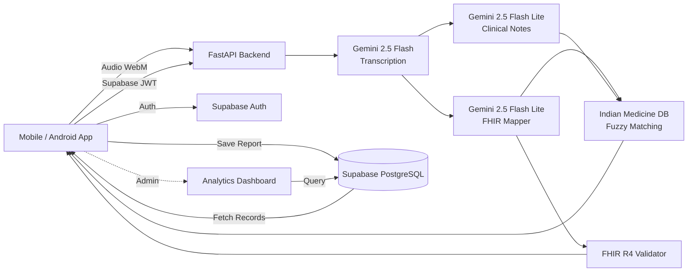

# AI Ambient Scribe — Mobile-First FHIR Clinical Notes

> **PS-1**: Mobile-First Ambient AI Scribe with Real-Time FHIR Conversion  
> **Team Eclipse** — Parth Singla (2401CS18) · Aditya Raj (2401MC56) · Aryan (2401CS48) · Manish Kumar (2401EE08)

A **production-deployed**, mobile-first AI-powered clinical documentation tool that converts doctor-patient conversations into structured, **FHIR R4-compliant clinical data** in real-time. Supports **Hindi, English, and Hinglish** conversations with automatic English-only report generation and a full **Hindi/English UI toggle** — designed for Indian healthcare settings.

 **Live App**: Frontend on [Vercel](https://vercel.com) · Backend on [Render](https://render.com)  
 **Android APK**: Pre-built APK available (`AI-Ambient-Scribe.apk`) — install directly on any Android device

---

## Proposed Approach & Solution

Indian healthcare faces a critical documentation bottleneck — doctors in Tier 2/3 cities spend nearly 30–40% of their consultation time manually writing notes, often in a mix of Hindi and English (Hinglish). This unstructured, paper-based workflow makes it nearly impossible to generate interoperable health records that comply with modern standards like HL7 FHIR R4. Existing voice-to-text solutions predominantly support English and lack clinical context understanding, making them ineffective for the Indian healthcare landscape.

Our solution, **AI Ambient Scribe**, is a mobile-first web application that passively listens to doctor-patient conversations in real-time and automatically produces structured, FHIR R4-compliant clinical documentation — all from a single tap on the doctor's phone.

The system works in a three-stage pipeline:

1. **Audio Capture & Transcription** — The recorded audio (captured via the browser's MediaRecorder API as WebM) is sent to the FastAPI backend, where **Google Gemini 2.5 Flash** performs multilingual transcription with automatic speaker diarization, accurately tagging each line as "Doctor" or "Patient" — even in code-mixed Hinglish conversations.

2. **AI-Powered Clinical Extraction** — The transcript is processed by two parallel **Gemini 2.5 Flash Lite** pipelines: one generates structured clinical notes (Chief Complaint, HPI, Vitals, Diagnoses with ICD-10 codes, Medications with RxNorm codes, Follow-up, and Advice), while the other maps clinical entities to a full **FHIR R4 Bundle** containing Patient, Encounter, Observation, Condition, and MedicationRequest resources with proper SNOMED-CT, LOINC, and RxNorm coding. **All output is forced to English** regardless of conversation language, ensuring proper medicine database matching and readable clinical records.

3. **Medicine Enrichment** — Extracted medication names are matched against a **100MB Indian medicines dataset** (200K+ drugs) using fuzzy matching. Each prescription is enriched with standardized name, composition, manufacturer, therapeutic class, and price from the database.

4. **Validation & Save** — The generated bundle is automatically validated against the FHIR R4 schema, and results are displayed with a pass/fail badge. The doctor can then **fully edit** every field (including individual medication dosage, frequency, duration, route, and custom fields), **save reports** linked to patients in the hospital's **Supabase** database, and **download** a polished prescription PDF.

Authentication is handled by **Supabase Auth** with separate Doctor, Patient, and Admin flows. Doctors register with email verification and manage a hospital patient database. All API endpoints are secured with Supabase JWT verification (ES256). The frontend is deployed on **Vercel**, the backend on **Render**, and a native **Android APK** is built with Capacitor.

---

## Features

### Core Clinical Features

| Feature | Description |
|---------|-------------|
|  **Hinglish Voice-to-Text** | Real-time transcription with **Doctor/Patient speaker tags** (diarization) using Gemini 2.5 Flash |
|  **Multilingual Input** | Hindi, English, and Hinglish (code-mixed) audio with language selector |
|  **English-Only Reports** | All clinical output (diagnoses, medications, notes) is auto-translated to English regardless of conversation language |
|  **Hindi/English UI Toggle** | Full app UI available in Hindi and English with one-click toggle (150+ translated strings) |
|  **Structured Clinical Notes** | Auto-extracted: Chief Complaint, HPI, Vitals, Diagnoses (ICD-10), Medications (RxNorm), Follow-up, Advice |
|  **Fully Editable Reports** | Edit every field inline — including individual medication name, dosage, frequency, duration, route, vitals, and diagnoses |
|  **Custom Fields** | Doctors can add custom name/value fields to any clinical report during editing |
|  **Live FHIR Sync** | Edits to clinical notes automatically rebuild the FHIR R4 JSON bundle in real-time |
|  **Downloadable PDF** | One-click polished A4 prescription PDF generation using html2pdf.js |
|  **FHIR R4 Bundle** | Patient, Encounter, Observation, Condition, MedicationRequest, DocumentReference resources |
|  **FHIR Validation** | Real-time validation against R4 schema with coding system checks (SNOMED, ICD-10, LOINC, RxNorm) |
|  **Indian Medicine Database** | 200K+ medicines with fuzzy matching — enriches prescriptions with composition, manufacturer, therapeutic class |
|  **Pipeline Speed Metrics** | Transcription + FHIR processing time displayed in real-time |

### Admin Dashboard — Analytics & Monitoring

| Feature | Description |
|---------|-------------|
|  **Consultation Volume Chart** | Interactive 14-day line chart showing daily consultation volume across the clinic (Recharts) |
|  **Top Prescribed Generics** | Horizontal bar chart of the 10 most commonly prescribed medications across all doctors |
|  **Gemini API Usage Counter** | Real-time estimated API call counter (per report × 3 calls) with daily/weekly breakdown and budget warnings |
| ⏱ **Total Time Saved** | Complexity-based calculator scoring each report by vitals, diagnoses, medications, and text length |
|  **Doctor Activity Heatmap** | 4-week × 7-day grid showing which days have the most consultations |
|  **Language Distribution** | Donut chart showing Hinglish vs Hindi vs English transcript distribution |
|  **Recent Activity Feed** | Live-style feed of the last 10 consultations across all doctors with clickable links |
|  **User Management** | Search, edit roles, and delete user accounts |
|  **Top Doctors Leaderboard** | Ranked list of most active doctors by consultation count |
|  **Common Diagnoses** | Tag cloud of the most frequent diagnoses across all reports |

### Authentication & Roles

| Feature | Description |
|---------|-------------|
|  **Supabase Auth** | Role-based auth (Doctor/Patient/Admin) with email verification and JWT-secured API |
|  **Doctor Dashboard** | Track patients, view report history, share reports with other doctors, start new consultations |
|  **Hospital Patient Database** | Register patients into the hospital database; access records via email + hospital password |
|  **Admin Dashboard** | Full analytics, user management, consultation tracking, patient database overview |
|  **Report Saving** | Save consultation reports to Supabase, linked to patients by name/email |

### Platform & Design

| Feature | Description |
|---------|-------------|
|  **Mobile-First PWA** | Glassmorphism dark theme, responsive design, installable on any phone |
|  **Native Android APK** | Built with Capacitor — installable APK with native device features |
|  **Production Deployed** | Frontend on **Vercel**, Backend on **Render** |
|  **Demo Scripts** | Built-in demo conversations (Viral Fever Hinglish, Diabetes English, Hypertension Hindi) for instant testing |

---

## Architecture



### Pipeline Flow

```
 Audio (WebM)
    →  Hinglish Transcript (verbatim, original language)
    →  Structured Notes (English only — auto-translated)
    →  Medicine Enrichment (Indian DB, 200K+ drugs)
    →  FHIR R4 Bundle (English, coded with SNOMED/ICD-10/LOINC/RxNorm)
    →  Validation
    →  Supabase
           ↕ Doctor Edits ↕           ↕ Auto-Sync ↕
```

---

## Tech Stack

| Layer | Technology |
|-------|-----------|
| **Frontend** | React 19 + TypeScript + Vite + Tailwind CSS |
| **Charts** | Recharts (line, bar, pie charts for admin analytics) |
| **Backend** | Python FastAPI + Uvicorn |
| **AI Engine** | Google Gemini 2.5 Flash (Transcription) + Gemini 2.5 Flash Lite (FHIR + Notes) |
| **Medicine DB** | 200K+ Indian medicines CSV with fuzzy matching (difflib) |
| **Authentication** | Supabase Auth (Email/Password, ES256 JWT, email verification) |
| **Database** | Supabase (PostgreSQL — profiles, reports, shared reports) |
| **Data Standard** | HL7 FHIR R4 |
| **Internationalization** | Custom i18n system (English + Hindi, 150+ strings) |
| **PDF Generation** | html2pdf.js |
| **Mobile Native** | Capacitor (Android APK) |
| **Frontend Hosting** | Vercel |
| **Backend Hosting** | Render |
| **Design** | Glassmorphism dark theme, mobile-first responsive |

---

## Quick Start

### Prerequisites
- **Node.js** 18+
- **Python** 3.10+
- **Gemini API Key** — [Get one here](https://aistudio.google.com/apikey)
- **Supabase Project** — [Create one here](https://supabase.com/dashboard)
- **Android Studio** (optional, for APK builds)

### 1. Supabase Setup

1. Create a new project at [supabase.com/dashboard](https://supabase.com/dashboard)
2. Enable **Email/Password** sign-in (Authentication → Providers → Email)
3. Run the following SQL in the SQL Editor to create required tables:

```sql
-- Profiles table (supports doctor, patient, admin roles)
CREATE TABLE profiles (
  id UUID PRIMARY KEY REFERENCES auth.users(id) ON DELETE CASCADE,
  email TEXT NOT NULL,
  display_name TEXT NOT NULL,
  role TEXT NOT NULL CHECK (role IN ('doctor', 'patient', 'admin')),
  created_at TIMESTAMPTZ DEFAULT NOW()
);

-- Reports table
CREATE TABLE reports (
  id UUID PRIMARY KEY DEFAULT gen_random_uuid(),
  doctor_id UUID REFERENCES profiles(id) ON DELETE CASCADE,
  doctor_name TEXT,
  patient_name TEXT NOT NULL,
  patient_email TEXT,
  transcript TEXT,
  structured_notes JSONB,
  fhir_bundle JSONB,
  language TEXT DEFAULT 'hi-en',
  created_at TIMESTAMPTZ DEFAULT NOW()
);

-- Shared reports table
CREATE TABLE shared_reports (
  id UUID PRIMARY KEY DEFAULT gen_random_uuid(),
  report_id UUID REFERENCES reports(id) ON DELETE CASCADE,
  shared_by UUID REFERENCES profiles(id),
  shared_with_email TEXT NOT NULL,
  message TEXT,
  created_at TIMESTAMPTZ DEFAULT NOW()
);

-- Enable RLS
ALTER TABLE profiles ENABLE ROW LEVEL SECURITY;
ALTER TABLE reports ENABLE ROW LEVEL SECURITY;
ALTER TABLE shared_reports ENABLE ROW LEVEL SECURITY;

-- RLS Policies (allow authenticated users full access)
CREATE POLICY "Authenticated users can manage profiles" ON profiles
  FOR ALL USING (auth.uid() IS NOT NULL);
CREATE POLICY "Authenticated users can manage reports" ON reports
  FOR ALL USING (auth.uid() IS NOT NULL);
CREATE POLICY "Authenticated users can manage shared_reports" ON shared_reports
  FOR ALL USING (auth.uid() IS NOT NULL);
```

4. Note your **Project URL**, **Anon Key**, and **JWT Secret** from Project Settings → API

### 2. Backend Setup

```bash
cd backend

# Create virtual environment
python3 -m venv venv
source venv/bin/activate  # On Windows: venv\Scripts\activate

# Install dependencies
pip install -r requirements.txt

# Configure environment
cat > .env << EOF
GEMINI_API_KEY=your_gemini_api_key_here
SUPABASE_URL=https://your-project.supabase.co
SUPABASE_JWT_SECRET=your_jwt_secret_here
EOF

# Start server
uvicorn main:app --reload --port 8000
```

### 3. Frontend Setup

```bash
cd frontend

# Install dependencies
npm install

# Configure environment
cat > .env << EOF
VITE_API_URL=http://localhost:8000/api
VITE_SUPABASE_URL=https://your-project.supabase.co
VITE_SUPABASE_ANON_KEY=your_supabase_anon_key_here
EOF

# Start dev server
npm run dev
```

### 4. Android APK Build (Optional)

```bash
cd frontend

# Build production bundle
npm run build

# Sync to Android project
npx cap sync android

# Open in Android Studio
npx cap open android

# Or build APK from command line (requires Java 21)
JAVA_HOME="/Applications/Android Studio.app/Contents/jbr/Contents/Home" \
  ./android/gradlew -p android assembleDebug
```

The APK will be at `frontend/android/app/build/outputs/apk/debug/app-debug.apk`.

### 5. Open the App

- **Web**: Navigate to **http://localhost:5173**
- **Android**: Install the APK on your device
- Register as a Doctor, Patient, or Admin to get started!

---

## API Endpoints

| Method | Endpoint | Auth | Description |
|--------|----------|------|-------------|
| `GET` | `/` |  | Service info |
| `GET` | `/health` |  | Basic health check |
| `GET` | `/health/detailed` |  | Detailed health (backend + Supabase DB status) |
| `POST` | `/api/transcribe/?language=hi-en` |  | Audio → Text transcription (Gemini 2.5 Flash) |
| `POST` | `/api/fhir/` |  | Transcript → FHIR Bundle + Structured Notes (English output) |
| `POST` | `/api/fhir/validate` |  | Validate a FHIR R4 Bundle |

All protected endpoints require a valid `Authorization: Bearer <supabase_jwt>` header.

---

## Project Structure

```
fhir-scribe-app/
├── AI-Ambient-Scribe.apk       # Pre-built Android APK
├── backend/
│   ├── main.py                  # FastAPI app with CORS, logging, health endpoints
│   ├── requirements.txt         # Python dependencies
│   ├── render.yaml              # Render deployment config
│   ├── .env                     # GEMINI_API_KEY + SUPABASE_URL + SUPABASE_JWT_SECRET
│   ├── data/
│   │   └── medicines.csv.gz     # Indian medicines database (200K+ drugs, gzipped)
│   └── services/
│       ├── auth.py              # Supabase JWT verification (ES256 via JWKS)
│       ├── transcription.py     # Audio → text (Gemini 2.5 Flash + multilingual + diarization)
│       ├── fhir_mapper.py       # Text → FHIR R4 + structured notes (English-only output)
│       ├── fhir_validator.py    # FHIR R4 validation engine
│       └── medicine_lookup.py   # Fuzzy medicine matching (exact → prefix → difflib)
├── frontend/
│   ├── index.html               # PWA-ready HTML
│   ├── capacitor.config.ts      # Capacitor config for Android builds
│   ├── vercel.json              # Vercel deployment config (SPA rewrites)
│   ├── android/                 # Android Studio project (Capacitor)
│   ├── src/
│   │   ├── supabase.ts          # Supabase client initialization
│   │   ├── i18n/
│   │   │   └── translations.ts  # English + Hindi translations (150+ strings)
│   │   ├── components/
│   │   │   └── LanguageToggle.tsx # Hindi/English toggle button
│   │   ├── contexts/
│   │   │   ├── AuthContext.tsx   # Supabase Auth state, login/register/logout
│   │   │   └── LanguageContext.tsx # i18n language provider with localStorage
│   │   ├── hooks/
│   │   │   └── usePwaInstall.ts  # PWA install prompt hook
│   │   ├── utils/
│   │   │   └── pdfDownload.ts    # PDF generation (web + Capacitor native)
│   │   ├── pages/
│   │   │   ├── LoginPage.tsx        # Doctor login + Hospital Patient Database access
│   │   │   ├── RegisterPage.tsx     # Doctor registration + Hospital patient registration
│   │   │   ├── DoctorDashboard.tsx  # Patient tracking, reports, share with other doctors
│   │   │   ├── PatientDashboard.tsx # Patient medical records view
│   │   │   ├── AdminDashboard.tsx   # Full analytics, charts, user management, monitoring
│   │   │   ├── ScribePage.tsx       # Recording, FHIR pipeline, full editing, FHIR sync
│   │   │   ├── ReportDetailPage.tsx # Full report detail view
│   │   │   └── PrintablePDFReport.tsx # A4 prescription PDF template
│   │   ├── App.tsx              # Router with protected & role-based routes
│   │   ├── App.css              # Custom animations, glassmorphism, chart styles
│   │   ├── index.css            # Tailwind + base styles
│   │   └── main.tsx             # React entry with AuthProvider + LanguageProvider
│   ├── package.json
│   ├── vite.config.ts
│   └── tailwind.config.js
├── Extensive_A_Z_medicines_dataset_of_India.csv  # Raw medicine dataset (100MB)
├── presentation/                # Hackathon presentation
├── screenshots/                 # App screenshots
└── README.md
```

---

## PS-1 Objectives Mapping

| Objective | Implementation | Status |
|-----------|---------------|--------|
| Capture conversations in real-time (Hindi + English mix) | MediaRecorder API → Gemini 2.5 Flash transcription with Hinglish prompt & speaker diarization |  |
| Convert speech into structured clinical notes | Structured Notes extraction (CC, HPI, Vitals, Dx, Rx, Follow-up, Advice) — all fully editable with add/remove. English-only output. |  |
| Map entities to FHIR resources | Patient, Encounter, Observation, Condition, MedicationRequest with SNOMED/ICD-10/LOINC/RxNorm — auto-synced on edit |  |
| Demonstrate documentation speed improvement | Complexity-based time savings calculator + real-time pipeline speed metrics |  |
| Functional Prototype (Mobile App) | Mobile-first PWA on Vercel + native Android APK via Capacitor |  |
| FHIR Mapping Layer | Full FHIR R4 Bundle generation with auto-validation engine + live edit sync |  |
| Multilingual Capability | Hindi, English, Hinglish audio + full Hindi/English UI toggle + English-only report output |  |
| Role-Based Access Control | Doctor + Patient + Admin dashboards with Supabase Auth (JWT) |  |
| Admin Analytics Dashboard | Consultation volume charts, top prescribed generics, API usage monitoring, time saved calculator, activity heatmap |  |

---

## Deployment

| Component | Platform | Environment Variables |
|-----------|----------|-----------------------|
| **Frontend** | Vercel | `VITE_API_URL`, `VITE_SUPABASE_URL`, `VITE_SUPABASE_ANON_KEY` |
| **Backend** | Render | `GEMINI_API_KEY`, `SUPABASE_URL`, `SUPABASE_JWT_SECRET`, `ALLOWED_ORIGINS` |
| **Android** | APK | Uses production env vars baked into the Vite build |

> **Important**: Set `ALLOWED_ORIGINS` on Render to your Vercel production URL (e.g., `https://your-app.vercel.app`).  
> Update the Supabase **Site URL** and **Redirect URLs** in Authentication → URL Configuration to your production domain.

---

## Team Eclipse

| Member | Roll No |
|--------|---------|
| **Parth Singla** | 2401CS18 |
| **Aditya Raj** | 2401MC56 |
| **Aryan** | 2401CS48 |
| **Manish Kumar** | 2401EE08 |

---
